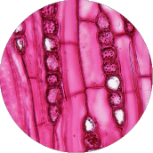

.. KBase SDK documentation master file, created by
   sphinx-quickstart on Tue Apr 24 17:10:34 2018.
   You can adapt this file completely to your liking, but it should at least
   contain the root `toctree` directive.

KBase SDK Documentation
=====================================

The KBase SDK is a set of tools for developing KBase Apps that can be dynamically registered and run on the |KBase_link|. Apps are grouped into modules that include all code, dependencies, specification files, and documentation needed to register and run in the KBase Narrative interface. By using Docker combined with the KBase App Catalog, you can build and run a new "Hello World!" App in KBase in minutes.

Most often, KBase SDK apps are wrappers around existing bioinformatics tools. Some reasons to consider wrapping your own tool:

* Make your app available to a wider user community
* Have control over its release and information
* Provide compute resources to the scientists using your app
* Gain more credit and citations from a growing user community
* Reference stats and examples of how people use your tools

To develop apps, start by obtaining a free KBase user account and applying for a KBase developer account by going to |accounts_link|. If you are a US citizen, your account should be created within a few days. For foreign nationals, it may take several weeks (and, in a few cases, you may not be able to get a developer account). Non-US citizens will be asked for additional information in order to process their application. Once your account is approved, contact us with your username and ask to be added to the developer list.

.. toctree::
    :caption: Intro
    :maxdepth: 1

    overview
    video_tutorial

.. toctree::
   :maxdepth: 1
   :numbered:
   :caption: Tutorial
   :name: tutorial

   tutorial/1_dependencies
   tutorial/2_install
   tutorial/3_initialize
   tutorial/4_helloworld
   tutorial/5_setup
   tutorial/6_inputsoutputs
   tutorial/7_implement
   tutorial/8_publish

.. image:: images/micro4.png
    :align: right
    :scale: 80 %

.. toctree::
    :maxdepth: 1
    :caption: Developer Guides
    :name: basic_guides

    references/questions_and_answers
    howtos/create_a_report
    howtos/add_ui_elements
    howtos/edit_your_dockerfile
    howtos/fill_out_app_information
    howtos/run_a_shell_command
    howtos/file_utils

.. toctree::
    :maxdepth: 1
    :caption: Advanced Guides
    :name: advanced_guides

    howtos/workspace
    howtos/manual_build
    howtos/work_with_reference_data
    howtos/job_manager
    howtos/dynamic_services
    howtos/update_to_py3

.. toctree::
    :maxdepth: 1
    :caption: References & Resources
    :name: references

    references/design_checklist
    references/troubleshooting
    references/dev_guidelines
    references/execution_engine
    references/module_anatomy
    references/KIDL_spec
    references/UI_spec
    references/terminology

.. External links

.. |KBase_link| raw:: html

   <a href="https://kbase.us" target="_blank">KBase Platform</a>

.. |accounts_link| raw:: html

   <a href=" https://accounts.kbase.us/index.php?tpl=request_identity.tpl" target="_blank"> https://accounts.kbase.us/index.php?tpl=request_identity.tpl</a>

