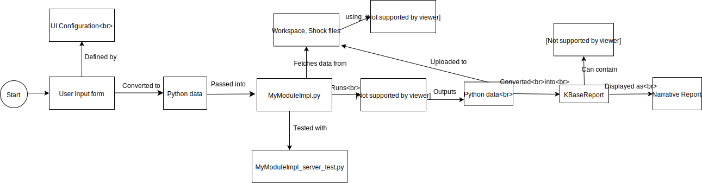

Concepts and Overview
=======================

This page gives a high-level overview of how the SDK works and the general concepts involved in making and running apps.

The Basics
--------------

.. image:: images/micro1.png
    :align: right

Apps on KBase, such as genome assemblers and annotators that run on narrative pages, are created using the KBase SDK.

When you run an app in a narrative, it runs in a docker container on KBase's servers. Learn more about docker containers here: https://www.docker.com/what-container. Docker containers allow you to package and compile programs and dependencies, such as `MEGAHIT <https://github.com/voutcn/megahit>`_, and run them anywhere.

As an SDK developer, you define your input parameter types, the packages and programs to run, and the output types, text, and HTML to show the user when the app finishes. To help facilitate development, a ``kb-sdk`` command-line utility is provided.

The Workflow
----------------

When a python SDK app runs in a narrative, it typically follows this workflow, which we'll describe in more detail below.

User Input
~~~~~~~~~~~~~~~

In the first page of a narrative app, users have a set of form elements that can be customized to accept many kinds of data. An example might be a genome assembly algorithm that takes a dataset of DNA reads and a minimum kmer size.

As an app developer, you can configure the elements of the form using a wide range of options. For parameters that refer to larger data sets, such as genomes, these will be passed into your app as *references*, which you can think of as simple URLs used to download the actual files.

App Code and Data Management
~~~~~~~~~~~~~~~~~~~~~~~~~~~~~~~

Input from the app's form is converted into a python dictionary and passed into a main method in your app. Typically, apps will perform a set of validation checks on the input to make sure everything is well-formed before running any algorithms.

From here, you can call out to utilities, run binary programs, and work with the file-system.

Output and Reporting
~~~~~~~~~~~~~~~~~~~~~~~

When an app finishes producing data, it will typically form a `KBaseReport <https://github.com/kbaseapps/KBaseReport>`_ object that can contain a number of different things:

* A formatted HTML page showing results
* Links to files, such as PDFs, CSVs, etc. that your app produced
* Links to saved, typed output objects, such as annotated or assembled genomes
* Simple text messages and warnings about the results

Command-line Interface
---------------------------

A command-line interface, called ``kb-sdk``, is provided to make it easy to initialize, validate, compile, and test your app. 

Docker
----------

The KBase SDK makes extensive use of Docker containers. The apps themselves run inside custom Docker images. The CLI, ``kb-sdk``, also runs within a Docker container. 

Using docker as the basic modular unit allows apps to run in different environments using custom dependencies. Also, apps written in different languages can use each other as dependencies.

Composing apps
---------------

Your app can install and use other KBase apps as dependencies, such as `KBParallel <https://github.com/kbaseapps/KBParallel>`_. Find these apps in github at https://github.com/kbaseapps or in the `KBase app catalog <https://narrative.kbase.us/#catalog/apps>`_.

When you install and run another app within yours, the other app runs in its own, separate docker container. SDK apps are also installed and tracked separately from any python dependencies that you install via `pip` or other package managers.

KBase Types and Parameters
--------------------------------

All of the data on KBase is strongly typed using an interface definition language called `KIDL <references/KIDL_spec.html>`_. This allows KBase to better cross-reference data, make inferences, and check app-to-data compatibility.

Configuration files in your app are used to define what parameters your app can accept and what kind of output it can return.

Working with files and data
-------------------------------

Scratch
~~~~~~~~~~~~~

Since SDK apps often run inside multiple docker containers, you have to store files in a special location that all containers have access to: **scratch**. Scratch is set to a directory running inside your app's docker container and is accessed from a special configuration variable in your app source code. This scratch directory is accessible to your app as long as it's running.

**Scratch is ephemeral** -- any files in the scratch directory are gone when your app stops running. To save files persistently (for example, to use in your report), you need to use **Workspaces**

The Workspace
~~~~~~~~~~~~~~~~~

The "Workspace" is the term used for the file storage servers used by KBase. For Python SDK apps, you can use apps such as `DataFileUtil <https://github.com/kbaseapps/DataFileUtil>`_, `AssemblyUtil <https://github.com/kbaseapps/AssemblyUtil>`_, and `GenomeFileUtil <https://github.com/kbaseapps/GenomeFileUtil>`_ to download and upload files to the workspace.

In general, you always want to use the workspace for any datasets you work with if you want them to be available to your users in the narrative.

A dataset stored in the workspace is referred to as an *object*. Objects in the workspace have some special properties:

* Every object conforms to a `type specification <references/KIDL_spec.html>`_.
* Objects are versioned
* The "reference" for an object has the format ``workspace_id/object_id/version``.
* Workspaces are authenticated

The Catalog
-------------

KBase's catalogs are registries of KBase apps. In order to find and use an app from within a narrative, it has to be registered in one of these catalogs. You can manage an app's registration from its module page on the KBase website.

There are three separate catalogs for testing purposes: `dev`, `beta`, and `release`. 

* `dev`: Prototype and tweak your app within the narrative
* `beta`: The app is ready for release but requires testing
* `release`: The app is visible to normal KBase users

Publishing
-----------------------

You can register a new app from this page: https://appdev.kbase.us/#appcatalog/register

Once you do so, it will be available in the ``dev`` catalog. This catalog is meant as experimentation grounds for new apps. When you're searching for apps, you need to be sure to filter by the development catalog to view your ``dev`` app.
