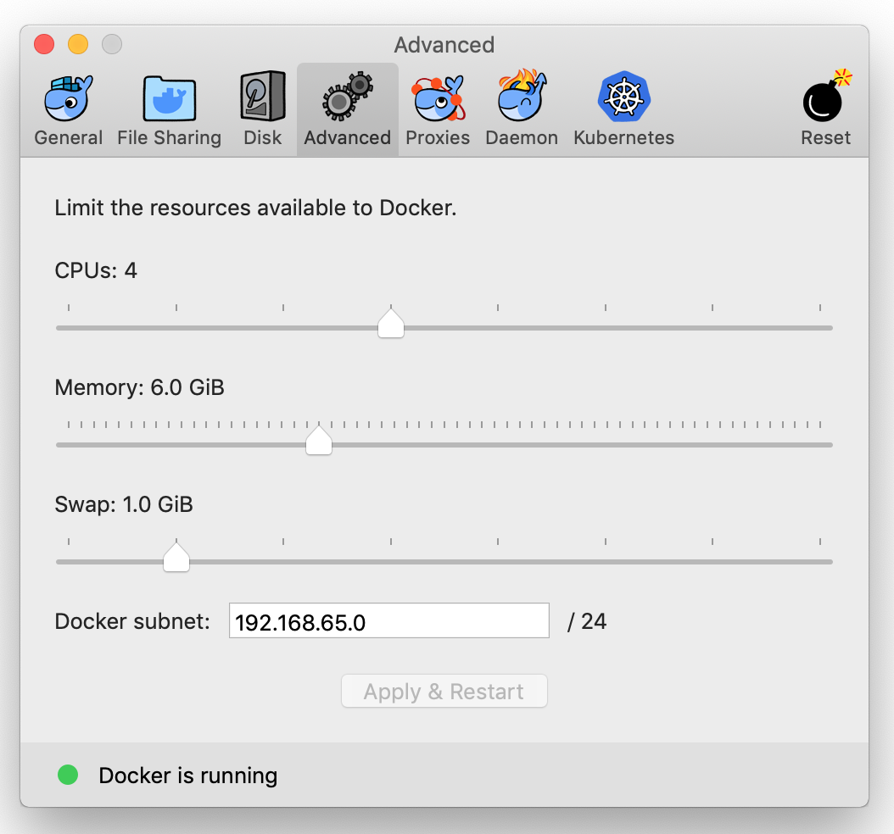

Troubleshooting Guide
=====================

.. contents::

Trying to run ``make sdkbase`` and seeing errors that include ``TLS-enabled daemon`` and/or ``docker daemon``
^^^^^^^^^^^^^^^^^^^^^^^^^^^^^^^^^^^^^^^^^^^^^^^^^^^^^^^^^^^^^^^^^^^^^^^^^^^^^^^^^^^^^^^^^^^^^^^^^^^^^^^^^^^^^

When you try to run ``make sdkbase`` if you see a message like:

.. code-block:: bash

    docker build -t kbase/kbase:sdkbase2.latest sdkbase
    Post http:///var/run/docker.sock/v1.20/build?cgroupparent=&cpuperiod=0&cpuquota=0&cpusetcpus=&cpusetmems=&cpushares=0&dockerfile=Dockerfile&memory=0&memswap=0&rm=1&t=kbase%2Fkbase%3Asdkbase.latest&ulimits=null: dial unix /var/run/docker.sock: no such file or directory.
    * Are you trying to connect to a TLS-enabled daemon without TLS?
    * Is your docker daemon up and running?
    make: *** [sdkbase] Error 1

You likely have not started your Docker daemon. On a Mac, that means running in the Docker CLI shell after starting Docker Kitematic and clicking on "Docker CLI" in the lower left corner (See  |installSDK_link| for guidance).

My code keeps disappearing. What happened to it?
^^^^^^^^^^^^^^^^^^^^^^^^^^^^^^^^^^^^^^^^^^^^^^^^^

Magic comments are comments that are used internally by the kbase_sdk in order to generate the implementation file when you make changes to the spec file.

Examples of magic comments include:

.. code:: python

    #BEGIN_HEADER
    # (This is where your import statements go)
    #END_HEADER

    #BEGIN_CLASS_HEADER
    # (This is where your class variables and functions go that you want imported)
    #END_CLASS_HEADER

    #BEGIN_CONSTRUCTOR
    # (This is in your init statement for your class goes)
    #END_CONSTRUCTOR

    #BEGIN YourFunctionName1
    # (This is where the implementation details of your functions go)
    #END YourFunctionName1

Any code created outside of the Magic Comments will not be included inside the final .impl implementation file.

Having trouble getting Docker working on Mac
^^^^^^^^^^^^^^^^^^^^^^^^^^^^^^^^^^^^^^^^^^^^^

It may be that your Docker installation may be incorrect, out of date,
or the daemon may not have been started. Please see |dockerMac_link| 

Having trouble getting Docker working on Linux
^^^^^^^^^^^^^^^^^^^^^^^^^^^^^^^^^^^^^^^^^^^^^^

It may be that your Docker installation may be incorrect, out of date,
or the daemon may not have been started. Please see |dockerLinux_link| 

Getting Java-related errors trying to run kb-sdk
^^^^^^^^^^^^^^^^^^^^^^^^^^^^^^^^^^^^^^^^^^^^^^^^

Java may not be installed, or the path may not be set properly. Please follow the directions for installation of Java at |dependencies_link|  and then set your *JAVA\_HOME* with

::

    # for bash
    export JAVA_HOME=`/usr/libexec/java_home`
    # for tcsh/csh
    setenv JAVA_HOME `/usr/libexec/java_home`

.. |alt text| image:: https://avatars2.githubusercontent.com/u/1263946?v=3&s=84

My report isn't generating output correctly
^^^^^^^^^^^^^^^^^^^^^^^^^^^^^^^^^^^^^^^^^^^^^

See the guide on |createReport_link|.

Getting "ServerError: JSONRPCError"
^^^^^^^^^^^^^^^^^^^^^^^^^^^^^^^^^^^^^

*Full error*: ``ServerError: JSONRPCError: -32601. Unknown server error (output data wasn't produced)``

This case happens because the python process exits without writing an output file, and then the callback server throws the above error. Make sure your process finishes and writes an output file to avoid this error.

Unable to find valid certification
^^^^^^^^^^^^^^^^^^^^^^^^^^^^^^^^^^^^

If you get an error on OSX as follows:

.. code-block:: console

    $ kb-sdk test
    > Validating module in (/Users/user/Module/ExpressionUtils)
    > Congrats- this module is valid.
    > Error while testing module: sun.security.validator.ValidatorException: PKIX path building failed: sun.security.provider.certpath.SunCertPathBuilderException: unable to find valid certification path to requested target
    > For more help and usage information, run:
    >     kb-sdk help
    >     (ExpressionUtils)

Reinstall the latest version of the KBase SDK

* Follow instructions at https://kbase.github.io/kb_sdk_docs/tutorial/2_install.html 
* Don't forget to generate the new `kb-sdk` executable

Alternatively, generate new security certificates:

.. code-block:: bash

    $ openssl x509 -in <(openssl s_client -connect ci.kbase.us:443 -prexit 2>/dev/null) -out ~/example.crt
    $ sudo keytool -importcert -file ~/example.crt -alias example -keystore $(/usr/libexec/java_home)/jre/lib/security/cacerts -storepass changeit

My Docker instances have run out of space
^^^^^^^^^^^^^^^^^^^^^^^^^^^^^^^^^^^^^^^^^

Sometimes, an error message might indicate that you’re out of space. Run this check:

.. code-block:: bash

    $ cd test_local
    $ ./run_bash.sh
    $ df -h

You can free up space by cleaning up containers, images, and volumes. If you end up needing a removed image or container, you can always download and recreate them later.

Remove stopped containers with ``docker container prune``

Remove orphan images with ``docker image prune``

.. note::

    Don't use the ``-a`` flag unless you want to blow away ALL KBase images and have to download them again

Remove local test images:

``docker images | grep -e 'test/' -e 'none' | awk '{print $3}' | xargs docker rmi``

If you encounter this error frequently, adjust how much disk space is allocated
to docker in docker's global preferences page (described in more detailed in the
following section).

My Docker container ran out of memory
^^^^^^^^^^^^^^^^^^^^^^^^^^^^^^^^^^^^^

This is perhaps the hardest to debug because it occurs during a run and dies (almost) silently.
It will typically occur when handling (multiple) large workspace objects such as plant genomes.
One way to figure out that it has happened is that the keyword "Killed" is printed.

If you suspect that your container is running out of memory, you may adjust
your Docker resource settings to alleviate the problem.

Go to the global preferences for Docker and click on "Advanced". There, you
can increase the amount of memory available to the containers.

    Advanced preferences in Docker for OS X.

Error Messages
^^^^^^^^^^^^^^
*Error*: ``KeyError: 'getpwuid()' uid not found: '``

*Solution*: Try changing the user flag in ``run_tests.sh``, ``run_bash.sh``, and ``run_subjobs.sh`` (if available) in the ``test_local`` directory to ``--user 0``. Alternatively, remove that flag altogether.

*Error*: ``Can't find image [test/<your_module_name>:latest]. Here is 'docker images' output: Cannot connect to the Docker daemon. Is the docker daemon running on this host?``

*Solution*: Run the following code snippet `docker run -it -v /var/run/docker.sock:/run/docker.sock alpine chmod g+w /run/docker.sock`

.. External links

.. |createReport_link| raw:: html

   <a href="../howtos/create_a_report.html" target="_blank">Creating a report </a>

 https://github.com/kbase/kb\_sdk/blob/master/doc/kb\_sdk\_dependencies.md

.. |dependencies_link| raw:: html

   <a href="https://github.com/kbase/kb_sdk/blob/master/doc/test_dependencies.md" target="_blank">https://github.com/kbase/kb_sdk/blob/master/doc/test_dependencies.md</a>

.. |dockerMac_link| raw:: html

   <a href="https://docs.docker.com/mac/" target="_blank">https://docs.docker.com/mac/</a>

.. |dockerLinux_link| raw:: html

   <a href="https://docs.docker.com/mac/" target="_blank">https://docs.docker.com/linux/</a>

.. Internal links

.. |installSDK_link| raw:: html

   <a href="../tutorial/install.html">Install SDK Dependencies - Docker </a>

