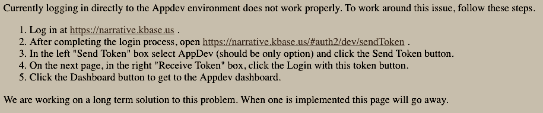

Publish and Update
====================

For all updates, it is good practice to update the RELEASE_NOTES.md file in the root directory for the module.

Publish all git commits
-------------------------

Make sure you have run ``git add`` and ``git commit`` on all the changes in your app's codebase, then ``git push`` to your public github URL. If you are part of a team writing the app, all the commits need to be pushed the the repo you want to use for KBase.

Appdev
------

|appdev_link| is a separate KBase narrative server that is used by app developers like yourself to publish in-progress versions of their apps and test and share them using real data. Registering and updating you module will be
done on the appdev server. After you click on the ``Sign In`` button and pick you authentication type, you will
encounter a screen with:

    Logging into Appdev

As the page says, direct login doesn't work and the page will go away when a solution is implemented.
If you are already logged into |prod_link|, start with step 2. Otherwise start at step 1. 
Step 4 will leave you at a page with no more hotlinks. In step 5, you will click on the Dashboard icon 
on the left and will be taken to the Dashboard that is the starting point in other environments.

Register with KBase
-----------------------

To see your app in a narrative, the module must first be registered. After you have logged into appdev,
go to the |Register_link| page.  Enter your public git repo for the URL:

.. figure:: ../images/register.png
    :align: center
    :figclass: align-center

    Register your module.

and click on ``Register``. Wait for the registration to complete (it may take a while on the first registration as it has to build the Docker image that is specific to your module from scratch).

This page can be used for both the initial registration and registering updates. Because you may be registering 
the module several times, a link to the page is also found at the top of the App Catalog.

.. figure:: ../images/register_module.png
    :align: center
    :figclass: align-center

    Top of App Catalog page for appdev

Note that you must be an approved developer to register a new module. You can apply for a 
KBase developer account by going to |accounts_link|. If you are a US citizen, your account 
can be created within a few days. For foreign nationals, it may take several weeks (and, 
in a few cases, you may not be able to get a developer account). Non-US citizens will be 
asked for additional information in order to process their application. Once your account 
is approved, contact us with your username and ask to be added to the developer list.

Once your app has been registered, it will be available in the AppDev environment in KBase. 
Go to |appdev_link| and start a new Narrative. Click on the 'R' in the Apps Panel  until it 
switches to 'D' ("develop") to show apps that are still in development.  Find your new app 
by searching for your module and run it!

Your app will now also be visible in the App Catalog when displaying Apps in development. 
Use the dropdown for ``Version`` and select "Apps in Development".

* Appdev: |appdevBrowse_link| 
* Production: |appcatBrowse_link| 

Once the module has been registered your narrative needs to know that you want to test apps in
the development environment. Go to |appdev_link| 
and create or open a narrative. In the ``APPS Panel`` on the left, click on the ``R`` to change 
the environment from ``released`` to ``beta``.

.. figure:: ../images/Change_to_beta.png
    :align: center
    :figclass: align-center

    Register your module.

Click on the ``B`` to change from ``beta`` to a ``D`` for development. You new app should be
among the apps listed in the ``APPS Panel``. On the documentation page for "Fully documenting your app",
you can assign one or more categories for your app. If you didn't assign a category, it will be
listed with the ``Uncategorized`` apps. Your app should appear when you click on the ``>``
and expand the list of apps in the category. On the same documentation page, you hopefully selected an icon
for your app. Creating a distinctive icon makes it easier to find in the list. It is ready for
you and any developers to test the app.

Updating and Beta
-----------------
    
The module must be re-registered every time you make updates. You can navigate to the module page using the App Catalog or go directly to: 

|MODULE_link|

To update an app, open the page, fill in the ``github`` public URL, and then click the **REGISTER** button. You can optionally specify a particular commit hash for your repository (useful if you want to test a feature branch prior to merging into master) or leave this field blank to build from the latest commit on the master branch.

As you make changes to your Module, **you will need to re-commit those changes to the git repo, and then re-register**. The KBase SDK Catalog service will automatically pull the most recent version. If for some reason you wish to revert to an older version, you can add the hash key of that older commit, which you can find by viewing the ``git log``.

The ver (version) in the ``spec.json`` file becomes important once an app has been released to prod. The version needs to be updated for each subsequent release. The list of authors may need to be updated as well if additional people contribute to revisions.  

Once you are happy with your app, you can click on the option to expose it in ``beta``. The ``beta``
environment is exposed in both appdev and in |prod_link|. As a ``beta`` app, you can have
other KBase users test the app in production and provide you with feedback.

When you have made you last changes and want to release the app to ``beta``, go to the App Catelog page 
|MODULE_link| for your module. The top header on the page will have "Module Catalog". If you are the module owner,
you will see ``>`` next to the words "Module Admin Tools". Click on the ``>``. The window will expand and you now have a link for 'Migrate Current Dev Version to Beta'. Click on the link and the app is in ``beta`` and available for all users to try.

Release to Production
---------------------

The final step is to get the app released. It is on the same page as requesting ``beta`` but the button you click
is called 'Request New Release'. The KBase Implementation Team staff will review the module and apps and make sure that
they meet both the |guidance_link| and the |MustHaves|.

.. important::

    Please bear in mind that for public release, your module must meet all the requirements laid out in the  |Policies_link|. We reserve the right to delay public release of SDK Modules until all requirements are met. Please take the time to familiarize yourself with these policies to avoid delay in releasing your Module.

.. External links

.. |appdev_link| raw:: html

   <a href="https://appdev.kbase.us" target="_blank">Appdev (https://appdev.kbase.us)</a>

.. |prod_link| raw:: html

   <a href="https://narrative.kbase.us" target="_blank">production (https://narrative.kbase.us)</a>

.. |accounts_link| raw:: html

   <a href=" https://accounts.kbase.us/index.php?tpl=request_identity.tpl" target="_blank">https://accounts.kbase.us/index.php?tpl=request_identity.tpl</a>

.. |Register_link| raw:: html

   <a href="https://appdev.kbase.us/#catalog/register" target="_blank">Module Registration</a>

.. |appdevBrowse_link| raw:: html

   <a href="https://appdev.kbase.us/#appcatalog/browse/dev" target="_blank">https://appdev.kbase.us/#appcatalog/browse/dev</a>

.. |appcatBrowse_link| raw:: html

   <a href="https://narrative.kbase.us/#appcatalog/browse/dev" target="_blank">https://narrative.kbase.us/#appcatalog/browse/dev</a>

.. |MODULE_link| raw:: html

   <a href="https://narrative.kbase.us/#appcatalog/module/my_module_name" target="_blank">https://narrative.kbase.us/#appcatalog/module/MODULE_NAME</a>

.. |MustHaves| raw:: html

    <a href="https://github.com/kbase/roadmap/blob/master/KBase%20product%20requirements.md">Must Haves</a>

.. Internal links

.. |Policies_link| raw:: html

   <a href="../references/dev_guidelines.html">KBase SDK Policies</a>

.. |guidance_link| raw:: html

    <a href="../references/dev_guidelines.html">Developer Guidance</a>
